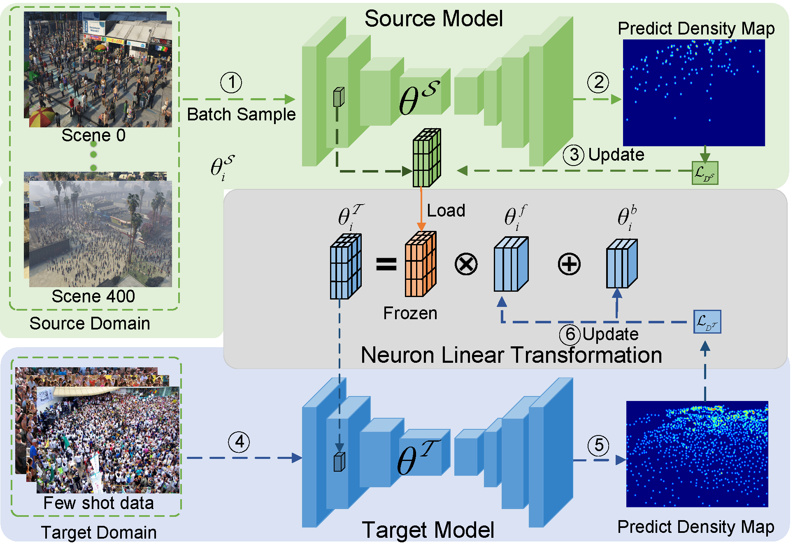

# NLT - Cross-domain Crowd Counting

---
This repo is the official implementation of [paper](https://ieeexplore.ieee.org/abstract/document/9337191/): **Neuron Linear Transformation: Modeling the
Domain Shift for Crowd Counting (T-NNLS, 2021)**. The code is developed based on [C3F](https://github.com/gjy3035/C-3-Framework).



#### Summary

* [Installation](#installation)
* [Project Architecture](#project-architecture)
* [Training](#training)
* [Test](#test)
# Getting Started


## Installation
It is recommended to prepare the following dependencies before training.

-  Prerequisites
    - Python 3.7
    - Pytorch >=1.5: http://pytorch.org .
    - other libs in ```requirements.txt```, run ```pip install -r requirements.txt```.
-  Code
    - Clone this repository in the directory (```Root/NLT```):
        ```bash
        git clone https://github.com/taohan10200/NLT.git
        ```
- Dataset downloading
    - the source dataset: GCC [[Link1](https://mailnwpueducn-my.sharepoint.com/:f:/g/personal/gjy3035_mail_nwpu_edu_cn/Eo4L82dALJFDvUdy8rBm6B0BuQk6n5akJaN1WUF1BAeKUA?e=ge2cRg)] [[Link2](https://v2.fangcloud.com/share/4625d2bfa9427708060b5a5981)] [[Link3](https://pan.baidu.com/s/1OtKqmw84TFbxAiN0H2xBtQ) (pwd:**utdo**)] 
    - other target datasets: 
    ShanghaiTech Part [[Link1](https://www.dropbox.com/s/fipgjqxl7uj8hd5/ShanghaiTech.zip?dl=0)] [[Link2](https://pan.baidu.com/s/1nuAYslz)]);
    UCF-QNRF [[Homepage](https://www.crcv.ucf.edu/data/ucf-qnrf/)] [[Download](https://drive.google.com/open?id=1fLZdOsOXlv2muNB_bXEW6t-IS9MRziL6)];
    UCSD [[Homepage](http://www.svcl.ucsd.edu/projects/peoplecnt/)];
    MALL [[Homepage](http://personal.ie.cuhk.edu.hk/~ccloy/downloads_mall_dataset.html)];
    WorldExpo'10 [[Homepage](http://www.ee.cuhk.edu.hk/~xgwang/expo.html)].
    - Generate the density map with the scripts in `Root/NLT/data_split/generate_den_map` 

## Project Architecture

  - Finally, the folder tree is below:
 ```
    -- ProcessedData
		|-- performed_bak_lite   # this is GCC dataset, which contains 100 scenes (a total of 400 folders).
            |-- scene_00_0
            |	   |-- pngs_544_960
            |	   |-- den_maps_k15_s4_544_960
            |-- ...
            |-- scene_99_3
            |	   |-- pngs_544_960
            |	   |-- den_maps_k15_s4_544_960
    	|-- SHHB
    	    |-- train
    	    |    |-- img
    	    |    |-- den
    	    |-- test
    	    |    |-- img
    	    |    |-- den
    	|-- ...		
	-- NLT
	  |-- data_split
	  |-- dataloader
	  |-- models
	  |-- ...
 ```

## Training

### Train ours NLT

Modify the flowing configurations in `config.py`:
 ```bash
__C.model_type = 'vgg16'   # choices=['ResNet50','vgg16']
__C.phase ='pre_train'     # choices=['pre_train', 'DA_train', 'fine_tune'])
__C.gpu_id = "2,3"         # single gpu:"0"..; multi gpus:"2,3,
__C.target_dataset ='SHHB' # dataset choices =  ['SHHB',  'UCF50',  'QNRF', 'MALL', 'UCSD', 'SHHA']

```
Then, run the command:
```bash
python nlt_train.py
```

### Pre_train on GCC dataset and then fine tune on others datasets


#### pre_train 
 modify the `__C.phase='pre_train'` in `config.py`, and then run: 
```bash
python pre_train.py
```
#### fine tune 
Find the pre-trained model in `Root/NLT/exp/pre`. Set the configurations `__C.GCC_pre_train_model`  
 and  `__C.phase='fine_tune'` in `config.py`, and then run: 
```bash
python pre_train.py
```


## Test
 To evaluate the metrics (MAE\MSE\PNSR\SSIM) on test set, you should fill the model path (`cc_path`) and dataset name in `test.py`, and then run:

 ```bash
python test.py
```

The visual density map can be selectively generated in `Root/NLT/visual-display`.

# Citation
If you find this project is useful for your research, please cite:
```
@article{wang2021neuron,
  title={Neuron linear transformation: modeling the domain shift for crowd counting},
  author={Wang, Qi and Han, Tao and Gao, Junyu and Yuan, Yuan},
  journal={IEEE Transactions on Neural Networks and Learning Systems},
  year={2021},
  publisher={IEEE}
}
```